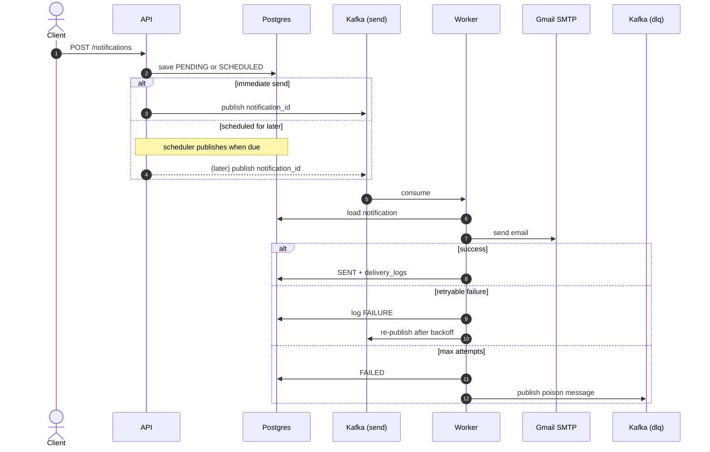

# NotifyHub

A small Go microservice that sends **email** notifications asynchronously through **Kafka**.

Built as a hands-on way to learn Kafka: produce jobs from an API, consume them in a worker, retry failures, and land permanent failures on a dead-letter topic.

## How it works

<p align="center">
  
</p>



1. `POST /notifications` saves the email in Postgres.
2. If send-now → publish the notification ID to `notifications.send`.
3. If `scheduled_at` is in the future → status `SCHEDULED`; the worker scheduler publishes when due.
4. The worker consumes the ID, loads the row, and sends via Gmail SMTP.
5. Each attempt is written to `delivery_logs`. Retries use exponential backoff; after max attempts the job goes to `notifications.dlq`.

## Stack

| Piece | Choice |
| ----- | ------ |
| Language | Go |
| HTTP | Chi |
| DB | PostgreSQL + pgx |
| Broker | Kafka (KRaft, Docker) |
| Email | Gmail SMTP |
| Logging | slog |
| Docs | OpenAPI (`docs/openapi.yaml`) |
| Tooling | Docker Compose, Makefile |

Redis is included in Compose for later use; the app does not use it yet.

## Quick start

```bash
cd notifyHub
cp .env.example .env
# set SMTP_USERNAME / SMTP_PASSWORD / SMTP_FROM (Gmail App Password)

make up
make migrate
make run-api      # terminal 1 → http://localhost:8080/health
make run-worker   # terminal 2
```

Send a test email:

```bash
curl -s -X POST http://localhost:8080/notifications \
  -H 'Content-Type: application/json' \
  -d '{"recipient":"you@example.com","subject":"Hello","body":"From NotifyHub"}'
```

Useful checks:

```bash
make kafka-topics          # notifications.send, notifications.dlq
make kafka-describe-group  # consumer lag / offsets
make kafka-dlq             # peek dead-letter messages
make test
```

## API

| Method | Path | Description |
| ------ | ---- | ----------- |
| `GET` | `/health` | Health check |
| `POST` | `/notifications` | Create / enqueue (or schedule) an email |
| `GET` | `/notifications` | List notifications |
| `GET` | `/notifications/{id}` | Get one notification |
| `GET` | `/notifications/{id}/logs` | Delivery attempts |
| `POST` | `/templates` | Create a template (`{{placeholders}}`) |
| `GET` | `/templates` | List templates |

Full schema: [docs/openapi.yaml](docs/openapi.yaml).

### Create notification

Immediate:

```bash
curl -s -X POST http://localhost:8080/notifications \
  -H 'Content-Type: application/json' \
  -d '{"recipient":"you@example.com","subject":"Hi","body":"Hello"}'
```

From a template:

```bash
curl -s -X POST http://localhost:8080/templates \
  -H 'Content-Type: application/json' \
  -d '{"name":"welcome","subject":"Hi {{name}}","body":"Welcome, {{name}}!"}'

curl -s -X POST http://localhost:8080/notifications \
  -H 'Content-Type: application/json' \
  -d '{"recipient":"you@example.com","template_id":"<id>","variables":{"name":"Ameer"}}'
```

Scheduled (ISO-8601 UTC):

```bash
curl -s -X POST http://localhost:8080/notifications \
  -H 'Content-Type: application/json' \
  -d '{"recipient":"you@example.com","subject":"Later","body":"Hi","scheduled_at":"2026-08-04T12:00:00Z"}'
```

## Kafka topics

| Topic | Purpose |
| ----- | ------- |
| `notifications.send` | Delivery jobs (payload: `{ "notification_id": "..." }`) |
| `notifications.dlq` | Permanent failures / poison messages |

Consumer group: `notifyhub-worker` (configurable).

**Learning focus:** produce after persist, consume + manual offset commit, retries via re-publish, DLQ for terminal failures, inspect groups with `make kafka-describe-group`.

## Data model

**notifications** — `id`, `recipient`, `subject`, `body`, `status` (`PENDING` \| `SCHEDULED` \| `PROCESSING` \| `SENT` \| `FAILED`), `scheduled_at`, `sent_at`, timestamps.

**templates** — `id`, `name` (unique), `subject`, `body`, `created_at`.

**delivery_logs** — `id`, `notification_id`, `provider`, `response`, `status` (`SUCCESS` \| `FAILURE`), `attempt`, `created_at`.

## Email (Gmail SMTP)

1. Turn on 2-Step Verification.
2. Create an [App Password](https://myaccount.google.com/apppasswords).
3. Put it in `.env`:

```bash
SMTP_HOST=smtp.gmail.com
SMTP_PORT=587
SMTP_USERNAME=you@gmail.com
SMTP_PASSWORD=your-16-char-app-password
SMTP_FROM=you@gmail.com
```

Retries: `MAX_DELIVERY_ATTEMPTS` (default 3), `RETRY_BACKOFF_SECONDS` (default 2 → 2s, 4s, 8s…).  
Scheduler poll: `SCHEDULER_INTERVAL_SECONDS` (default 5).

## Layout

```text
notifyHub/
├── cmd/api/            # HTTP API
├── cmd/worker/         # Kafka consumer + scheduler
├── internal/
│   ├── config/
│   ├── handler/
│   ├── service/
│   ├── repository/
│   ├── models/
│   ├── queue/          # Kafka producer / consumer
│   ├── email/          # Gmail SMTP
│   └── scheduler/      # due SCHEDULED → Kafka
├── pkg/logger/
├── migrations/
├── docs/openapi.yaml
├── docker-compose.yml
└── Makefile
```

## What we built (MVP)

1. Local stack: Postgres, Kafka, Redis (Compose)
2. REST API to create and query notifications
3. Kafka produce / consume pipeline
4. Real email via Gmail SMTP
5. Retries, delivery logs, DLQ
6. Templates + scheduled sends
7. Tests + OpenAPI docs

## Possible next steps

- JWT auth, rate limiting, webhooks
- Use Redis (idempotency / rate limits)
- SMS / push channels
- Prometheus metrics, OpenTelemetry
- Kubernetes deploy
